# MRMesh 架构流程图详解

## 1. 系统整体架构图

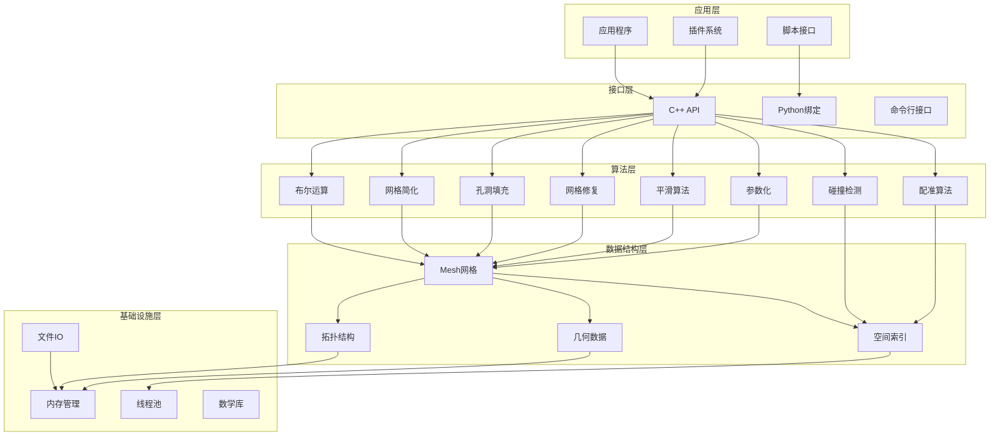

## 2. 半边数据结构详细流程图

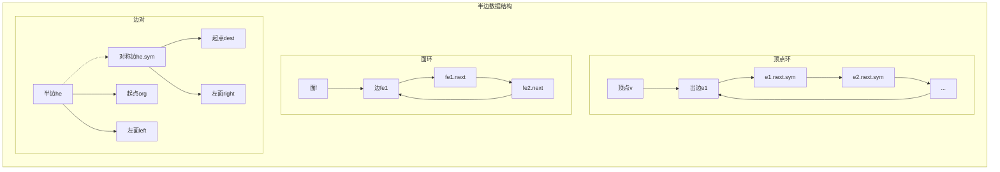

## 3. 网格构建流程

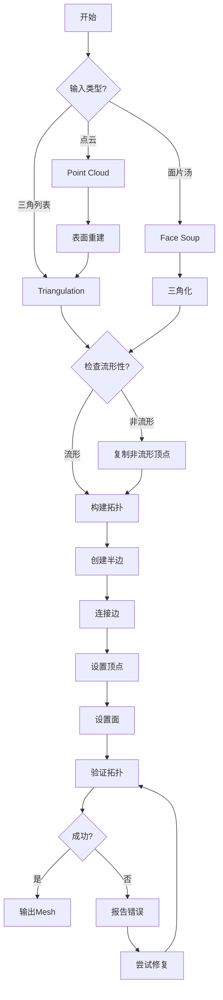

## 4. AABB树构建与查询流程

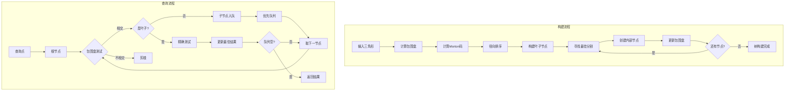

## 5. 网格布尔运算详细流程

```mermaid
stateDiagram-v2
    [*] --> 预处理
    
    state 预处理 {
        输入验证 --> 构建AABB树
        构建AABB树 --> 计算包围盒
    }
    
    预处理 --> 相交检测
    
    state 相交检测 {
        [*] --> 宽相检测
        宽相检测 --> 窄相检测
        
        state 宽相检测 {
            AABB重叠测试 --> 候选对生成
        }
        
        state 窄相检测 {
            三角形相交 --> 交线计算
            交线计算 --> 交点排序
        }
    }
    
    相交检测 --> 网格分割
    
    state 网格分割 {
        [*] --> 边分割
        边分割 --> 面分割
        面分割 --> 重新三角化
        
        state 重新三角化 {
            约束Delaunay --> 质量优化
        }
    }
    
    网格分割 --> 分类标记
    
    state 分类标记 {
        [*] --> 种子选择
        种子选择 --> 区域生长
        区域生长 --> 内外判定
        
        state 内外判定 {
            射线法 --> 卷绕数法
            卷绕数法 --> 标记验证
        }
    }
    
    分类标记 --> 结果组装
    
    state 结果组装 {
        选择保留面 --> 边界识别
        边界识别 --> 缝合边界
        缝合边界 --> 拓扑清理
    }
    
    结果组装 --> 后处理
    
    state 后处理 {
        移除孤立 --> 合并重复
        合并重复 --> 优化网格
    }
    
    后处理 --> [*]
```

## 6. 网格简化算法流程

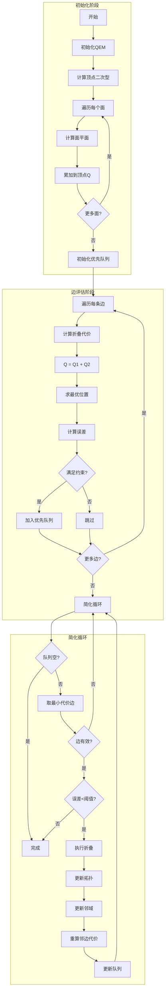

## 7. 孔洞填充算法流程

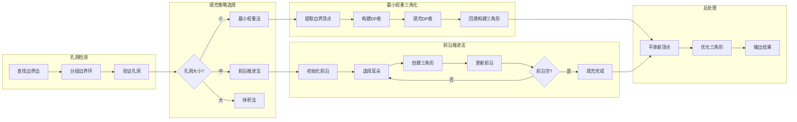

## 8. 内存管理架构

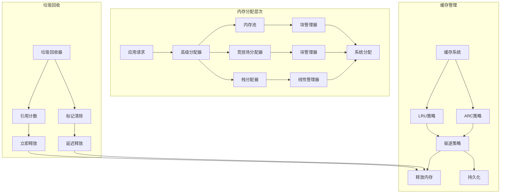

## 9. 并行处理架构

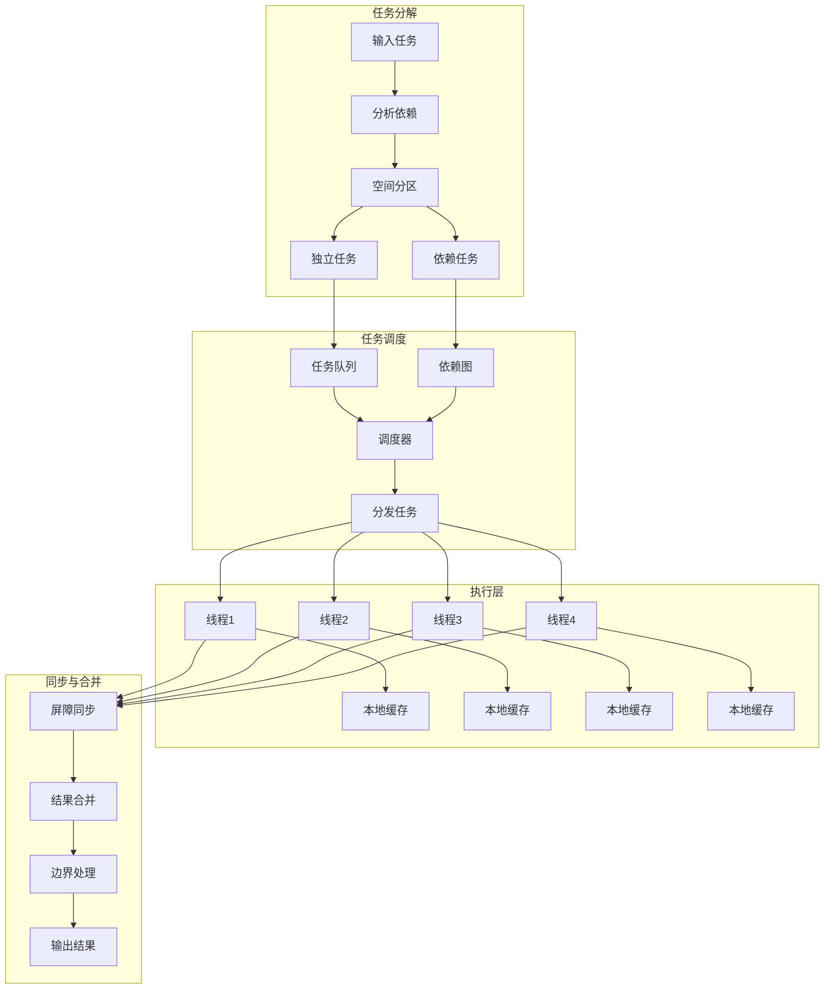

## 10. 网格修复流程

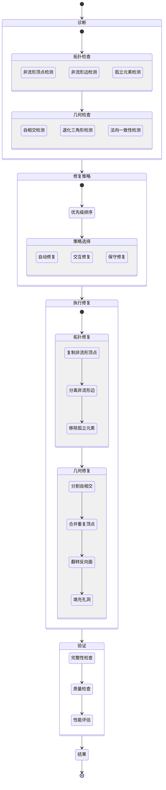

## 11. 碰撞检测流程

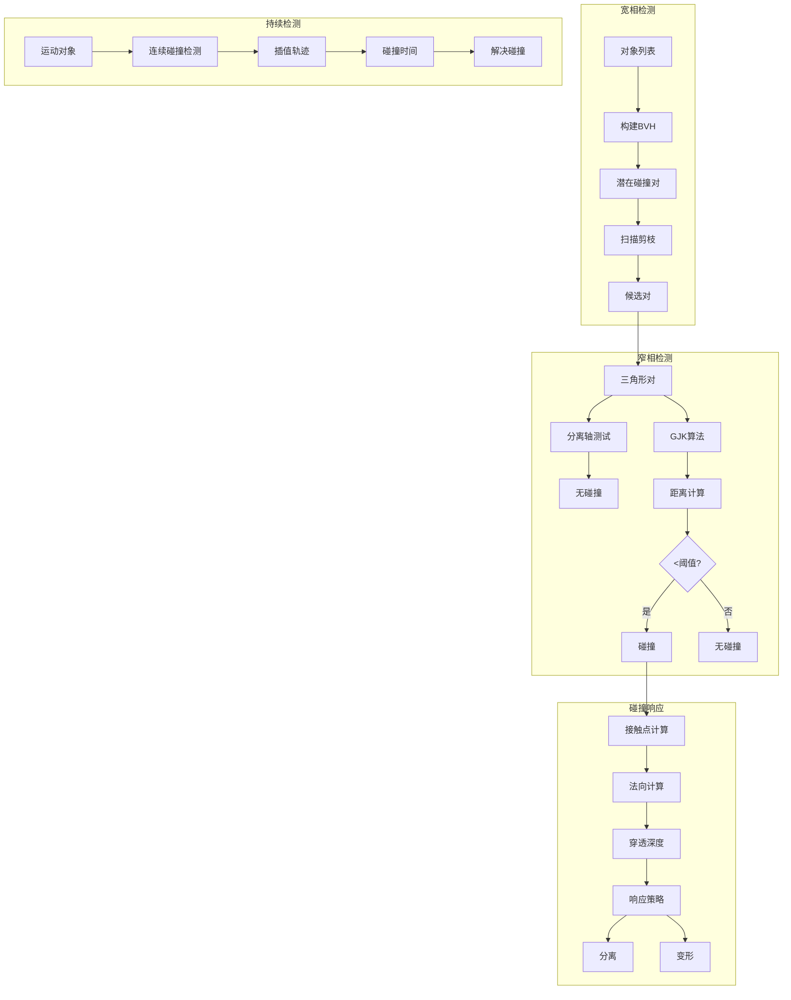

## 12. 表面参数化流程

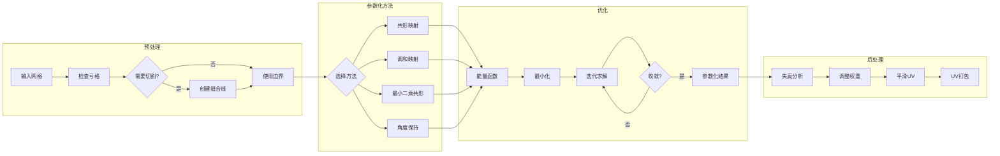

## 13. 网格平滑算法流程

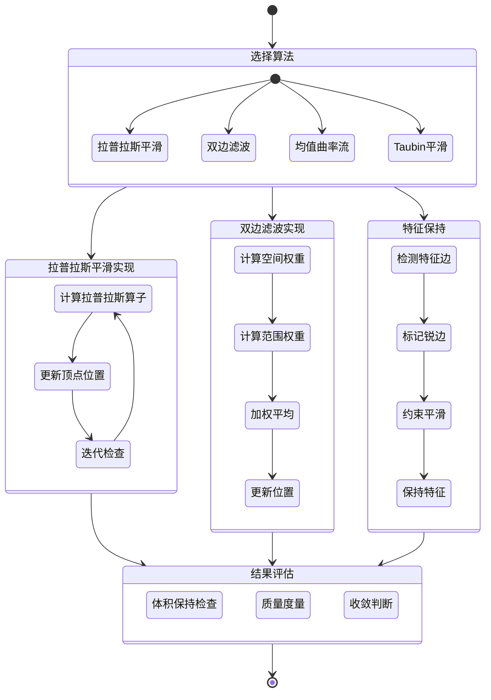

## 14. 文件IO处理流程

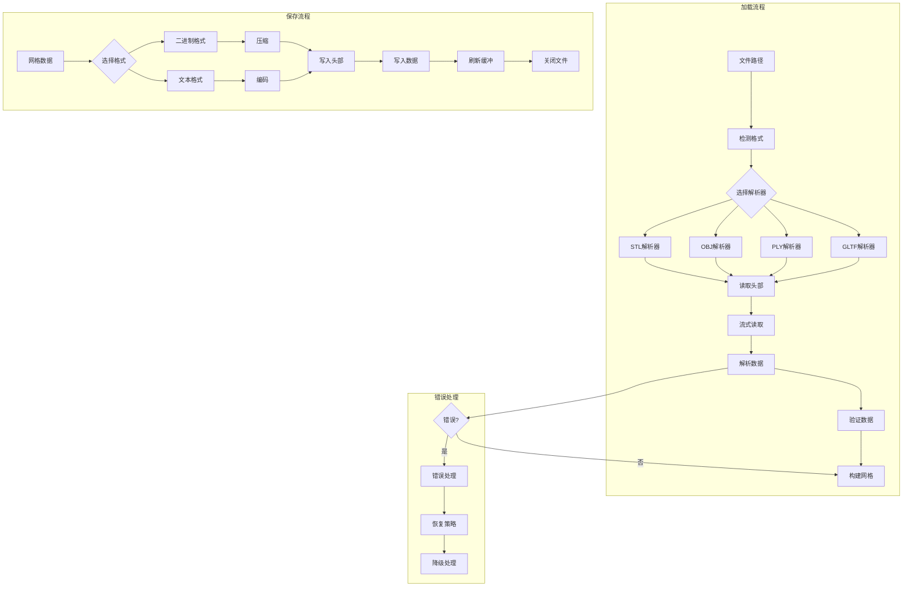

## 15. 性能分析工具集成

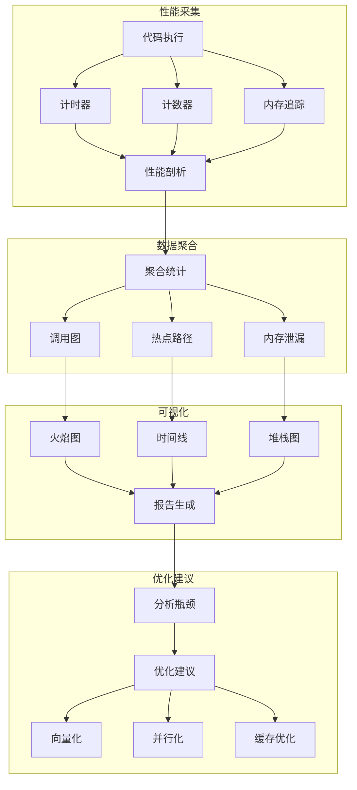

---

## 总结

这些流程图详细展示了MRMesh库的核心架构和算法实现流程。每个流程图都反映了实际代码中的设计思路和执行逻辑：

1. **模块化设计**：各组件职责明确，相互独立
2. **分层架构**：从应用层到基础设施层的清晰分层
3. **算法优化**：每个算法都经过精心设计和优化
4. **并行处理**：充分利用多核处理器能力
5. **错误处理**：完善的错误检测和恢复机制

这些流程图可以帮助开发者：
- 理解系统整体架构
- 掌握核心算法流程
- 进行性能优化
- 排查和解决问题
- 扩展新功能

---

*本文档使用Mermaid语法编写，可在支持Mermaid的Markdown查看器中直接渲染为图表。*