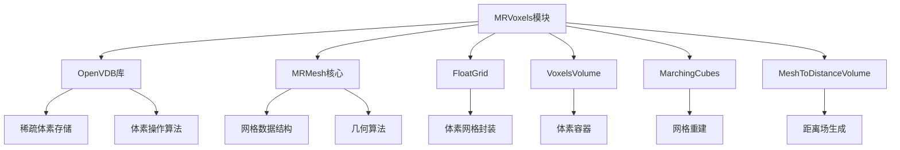
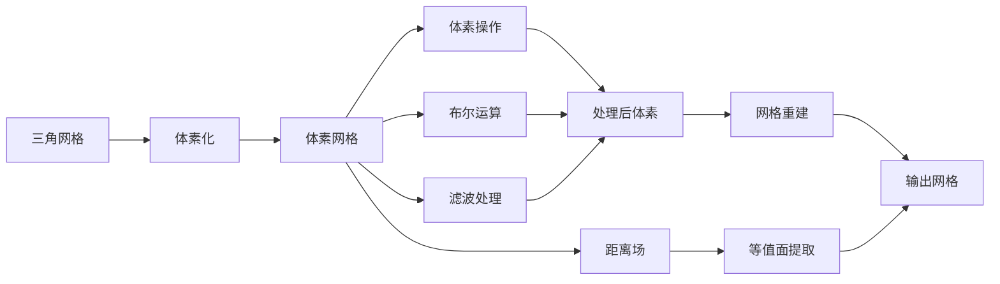
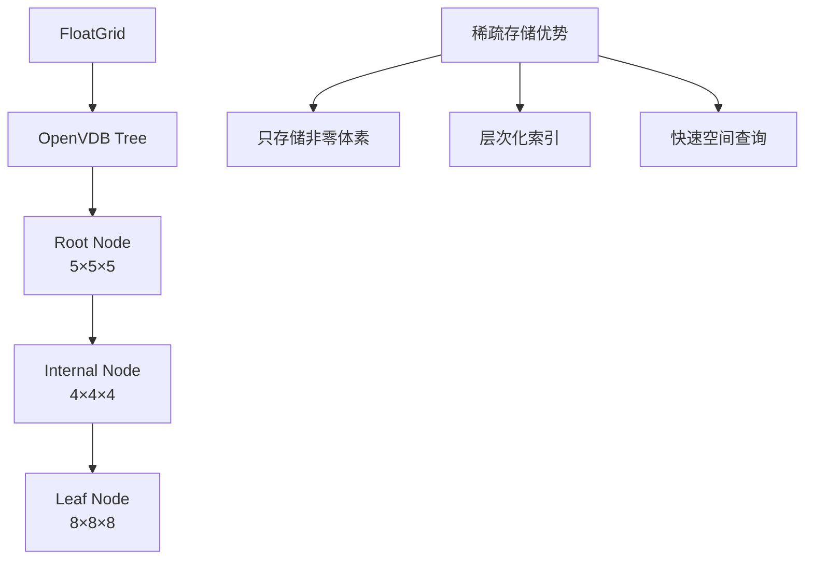
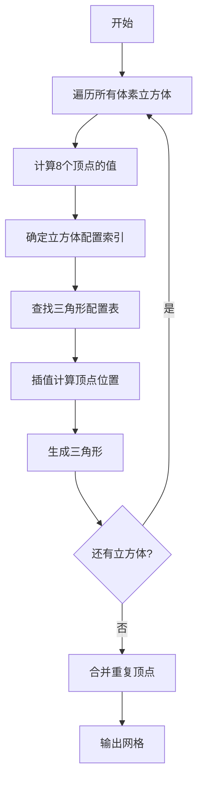
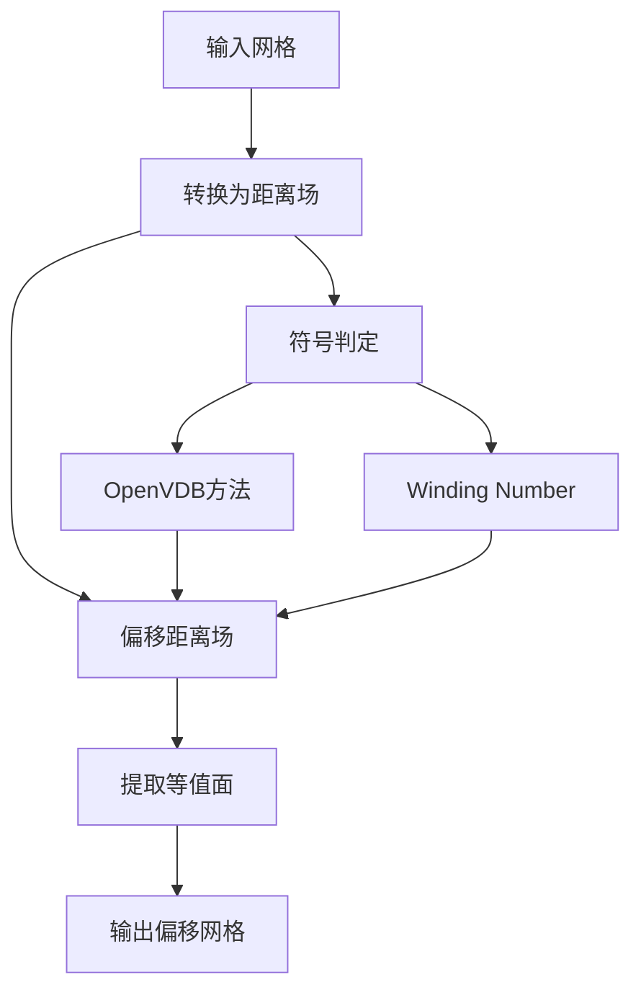

# MRVoxels算法模块深度分析

## 目录

1. [概述](#1-概述)
2. [核心架构设计](#2-核心架构设计)
3. [体素数据结构](#3-体素数据结构)
4. [核心算法实现](#4-核心算法实现)
5. [性能优化技术](#5-性能优化技术)
6. [应用场景与实践](#6-应用场景与实践)
7. [API使用指南](#7-api使用指南)
8. [常见问题与调试](#8-常见问题与调试)

---

## 1. 概述

### 1.1 模块简介

MRVoxels是MeshLib中的核心体素处理模块，提供了完整的体素化算法、体素操作和网格重建功能。该模块基于OpenVDB库实现高效的稀疏体素存储，并提供了多种体素处理算法。

### 1.2 核心功能

- **体素化转换**：将三角网格转换为体素表示
- **距离场计算**：支持有符号和无符号距离场
- **网格重建**：通过Marching Cubes算法从体素重建网格
- **布尔运算**：支持体素级别的并集、交集、差集运算
- **网格偏移**：基于体素的网格偏移和壳体生成
- **体素滤波**：高斯、中值、均值滤波
- **路径规划**：体素空间中的最短路径算法

### 1.3 技术栈

- **OpenVDB**：工业级稀疏体素存储库
- **Marching Cubes**：经典的等值面提取算法
- **Dual Marching Cubes**：改进的等值面提取算法
- **Fast Winding Number**：快速内外判定算法
- **Graph Cut**：图割分割算法

---

## 2. 核心架构设计

### 2.1 模块依赖关系



### 2.2 数据流架构



### 2.3 模块组成

| 组件名称 | 功能描述 | 核心文件 |
|---------|---------|---------|
| FloatGrid | OpenVDB网格封装 | MRFloatGrid.h/cpp |
| VoxelsVolume | 体素容器模板 | MRVoxelsVolume.h |
| MarchingCubes | 网格重建算法 | MRMarchingCubes.h/cpp |
| VDBConversions | VDB转换工具 | MRVDBConversions.h/cpp |
| MeshToDistanceVolume | 距离场生成 | MRMeshToDistanceVolume.h/cpp |
| Offset | 网格偏移算法 | MROffset.h/cpp |
| Boolean | 布尔运算 | MRBoolean.h/cpp |
| VoxelFilter | 体素滤波 | MRVoxelFilter.h/cpp |

---

## 3. 体素数据结构

### 3.1 VoxelsVolume模板

```cpp
// 体素容器的核心模板结构
template <typename T>
struct VoxelsVolume
{
    using ValueType = typename VoxelTraits<T>::ValueType;
    
    T data;                              // 体素数据存储
    Vector3i dims;                       // 体素网格维度
    Vector3f voxelSize{1.f, 1.f, 1.f}; // 单个体素尺寸
    
    size_t heapBytes() const;           // 内存占用统计
};
```

#### 3.1.1 体素容器类型

1. **SimpleVolume**: 密集存储的浮点体素
   - 使用`Vector<float, VoxelId>`存储
   - 适用于小规模、密集数据

2. **VdbVolume**: 稀疏存储的体素
   - 使用OpenVDB的FloatGrid
   - 适用于大规模、稀疏数据

3. **FunctionVolume**: 函数式体素
   - 使用`VoxelValueGetter<float>`
   - 按需计算，节省内存

4. **SimpleBinaryVolume**: 二值体素
   - 使用VoxelBitSet存储
   - 适用于二值分割

### 3.2 FloatGrid封装

```cpp
class FloatGrid
{
private:
    std::shared_ptr<OpenVdbFloatGrid> ptr_;
    
public:
    // 构造和管理
    FloatGrid();
    FloatGrid(std::shared_ptr<OpenVdbFloatGrid> ptr);
    
    // 访问接口
    OpenVdbFloatGrid* get() const noexcept;
    OpenVdbFloatGrid& operator*() const noexcept;
    
    // 体素操作
    float getValue(const Vector3i& p);
    void setValue(const Vector3i& p, float value);
    
    // 布尔运算符重载
    FloatGrid operator+=(const FloatGrid& b);  // 并集
    FloatGrid operator-=(const FloatGrid& b);  // 差集
    FloatGrid operator*=(const FloatGrid& b);  // 交集
};
```

### 3.3 内存布局优化



### 3.4 体素索引系统

```cpp
// 3D体素坐标到1D索引的转换
class VolumeIndexer
{
    Vector3i dims_;
    
public:
    size_t toVoxelId(const Vector3i& pos) const 
    {
        return pos.x + dims_.x * (pos.y + dims_.y * pos.z);
    }
    
    Vector3i toPos(size_t id) const 
    {
        Vector3i res;
        res.x = id % dims_.x;
        res.y = (id / dims_.x) % dims_.y;
        res.z = id / (dims_.x * dims_.y);
        return res;
    }
};
```

---

## 4. 核心算法实现

### 4.1 Marching Cubes算法

#### 4.1.1 算法原理

Marching Cubes是一种从体素数据中提取等值面的经典算法。算法将体素空间划分为立方体单元，通过查找表确定每个立方体内的三角形配置。



#### 4.1.2 核心实现

```cpp
struct MarchingCubesParams
{
    Vector3f origin;                    // 体素盒子原点
    float iso = 0.0f;                  // 等值面阈值
    bool lessInside = false;           // 内部判定方向
    VoxelPointPositioner positioner;   // 顶点定位函数
    int maxVertices = INT_MAX;         // 最大顶点数限制
    
    enum class CachingMode {
        Automatic,  // 自动选择
        None,       // 不缓存
        Normal      // 标准缓存
    } cachingMode = CachingMode::Automatic;
};

// Marching Cubes主函数
Expected<Mesh> marchingCubes(
    const SimpleVolume& volume, 
    const MarchingCubesParams& params)
{
    // 1. 分配顶点和面片缓冲区
    std::vector<Vector3f> vertices;
    std::vector<Triangle> triangles;
    
    // 2. 并行处理体素块
    ParallelFor(0, volume.dims.z - 1, [&](int z) {
        for (int y = 0; y < volume.dims.y - 1; ++y) {
            for (int x = 0; x < volume.dims.x - 1; ++x) {
                processCube(x, y, z, volume, params, 
                           vertices, triangles);
            }
        }
    });
    
    // 3. 构建网格
    return Mesh::fromTriangles(vertices, triangles);
}
```

#### 4.1.3 查找表优化

```cpp
// 256种立方体配置的三角形模板
const std::array<TriangulationPlan, 256> cTriangleTable = {
    // 配置0: 没有三角形
    {},
    // 配置1: 一个角点在内部
    {0, 8, 3},
    // 配置2: 另一个角点在内部
    {0, 1, 9},
    // ... 总共256种配置
};

// 12条边的索引映射
constexpr std::array<EdgeDirIndex, 12> cEdgeIndicesMap = {
    {0, NeighborDir::X}, {1, NeighborDir::Y},
    {2, NeighborDir::X}, {0, NeighborDir::Y},
    // ...
};
```

### 4.2 网格到体素转换

#### 4.2.1 距离场生成


#### 4.2.2 实现代码

```cpp
Expected<SimpleVolumeMinMax> meshToDistanceVolume(
    const MeshPart& mp,
    const MeshToDistanceVolumeParams& params)
{
    // 1. 计算包围盒
    Box3f box = mp.mesh.computeBoundingBox(mp.region);
    box.expand(params.vol.voxelSize * params.vol.offset);
    
    // 2. 创建体素网格
    Vector3i dims = calcDims(box, params.vol.voxelSize);
    SimpleVolumeMinMax volume;
    volume.dims = dims;
    volume.voxelSize = params.vol.voxelSize;
    volume.data.resize(dims.x * dims.y * dims.z);
    
    // 3. 构建加速结构
    AABBTree tree(mp.mesh, mp.region);
    
    // 4. 并行计算距离
    ParallelFor(0, dims.z, [&](int z) {
        for (int y = 0; y < dims.y; ++y) {
            for (int x = 0; x < dims.x; ++x) {
                Vector3f pos = indexToWorld(x, y, z, volume);
                float dist = tree.signedDistance(pos, params.dist);
                volume.data[toVoxelId(x, y, z)] = dist;
            }
        }
    });
    
    return volume;
}
```

### 4.3 体素布尔运算

#### 4.3.1 运算原理

体素布尔运算通过对两个体素网格的距离场进行运算来实现：

- **并集(Union)**: `min(d1, d2)`
- **交集(Intersection)**: `max(d1, d2)`
- **差集(Difference)**: `max(d1, -d2)`

```cpp
// 并集运算
FloatGrid operator+=(FloatGrid& a, const FloatGrid& b)
{
    // 使用OpenVDB的CSG运算
    openvdb::tools::csgUnion(*a.ptr_, *b.ptr_);
    return a;
}

// 交集运算
FloatGrid operator*=(FloatGrid& a, const FloatGrid& b)
{
    openvdb::tools::csgIntersection(*a.ptr_, *b.ptr_);
    return a;
}

// 差集运算
FloatGrid operator-=(FloatGrid& a, const FloatGrid& b)
{
    openvdb::tools::csgDifference(*a.ptr_, *b.ptr_);
    return a;
}
```

### 4.4 网格偏移算法

#### 4.4.1 算法流程



#### 4.4.2 核心实现

```cpp
Expected<Mesh> offsetMesh(
    const MeshPart& mp, 
    float offset,
    const OffsetParameters& params)
{
    // 1. 转换为距离场
    FloatGrid grid;
    if (params.signDetectionMode == SignDetectionMode::OpenVDB) {
        // 使用OpenVDB的level set
        grid = meshToLevelSet(mp, xf, voxelSize, 
                             params.surfaceOffset);
    } else {
        // 使用自定义距离场
        grid = meshToDistanceField(mp, xf, voxelSize, 
                                  params.surfaceOffset);
        
        // 应用winding number进行符号判定
        if (params.signDetectionMode == 
            SignDetectionMode::HoleWindingRule) {
            makeSignedByWindingNumber(grid, voxelSize, 
                                     mp.mesh, settings);
        }
    }
    
    // 2. 偏移操作（改变等值面位置）
    float isoValue = -offset;  // 负值因为内部为负
    
    // 3. 提取等值面
    GridToMeshSettings meshSettings;
    meshSettings.isoValue = isoValue;
    meshSettings.voxelSize = voxelSize;
    meshSettings.adaptivity = params.adaptivity;
    
    return gridToMesh(grid, meshSettings);
}
```

### 4.5 体素滤波算法

#### 4.5.1 高斯滤波

```cpp
void gaussianFilter(FloatGrid& grid, int width, int iters)
{
    using namespace openvdb::tools;
    
    for (int i = 0; i < iters; ++i) {
        // 应用高斯核
        Filter<FloatGrid> filter(*grid.ptr_);
        filter.gaussian(width);
    }
}
```

#### 4.5.2 中值滤波

```cpp
VdbVolume voxelFilter(
    const VdbVolume& volume, 
    VoxelFilterType type,
    int width)
{
    FloatGrid filtered = volume.data;
    
    switch(type) {
    case VoxelFilterType::Median:
        applyMedianFilter(filtered, width);
        break;
    case VoxelFilterType::Mean:
        applyMeanFilter(filtered, width);
        break;
    case VoxelFilterType::Gaussian:
        gaussianFilter(filtered, width, 1);
        break;
    }
    
    return floatGridToVdbVolume(filtered);
}
```

---

## 5. 性能优化技术

### 5.1 稀疏存储优化

#### 5.1.1 OpenVDB树结构

```mermaid
graph TD
    A[根节点<br/>5^3=125] --> B[内部节点1<br/>4^3=64]
    A --> C[内部节点2<br/>4^3=64]
    B --> D[叶子节点<br/>8^3=512]
    B --> E[叶子节点<br/>8^3=512]
    
    F[优势]
    F --> G[空间效率<br/>只存储活跃体素]
    F --> H[快速访问<br/>O(log n)查询]
    F --> I[层次剔除<br/>跳过空区域]
```

#### 5.1.2 内存优化策略

```cpp
// 内存高效的体素处理
struct MemoryEfficientVoxelizer
{
    // 使用FunctionVolume延迟计算
    FunctionVolume createFunctionVolume(const Mesh& mesh)
    {
        FunctionVolume volume;
        volume.dims = calculateDims(mesh);
        
        // 延迟计算，按需生成
        volume.data = [&mesh](const Vector3i& pos) -> float {
            Vector3f worldPos = voxelToWorld(pos);
            return calculateDistance(mesh, worldPos);
        };
        
        return volume;
    }
    
    // 分块处理大规模数据
    void processLargeVolume(const VdbVolume& volume)
    {
        const int blockSize = 64;
        
        for (int z = 0; z < volume.dims.z; z += blockSize) {
            // 每次只加载一个块到内存
            auto block = loadBlock(volume, z, blockSize);
            processBlock(block);
            saveBlock(block, z);
        }
    }
};
```

### 5.2 并行计算优化

#### 5.2.1 多线程体素化

```cpp
void parallelVoxelization(const Mesh& mesh, SimpleVolume& volume)
{
    const int numThreads = std::thread::hardware_concurrency();
    
    // Z轴分层并行
    ParallelFor(0, volume.dims.z, [&](int z) {
        // 每个线程处理一层
        for (int y = 0; y < volume.dims.y; ++y) {
            for (int x = 0; x < volume.dims.x; ++x) {
                size_t id = toVoxelId(x, y, z, volume.dims);
                volume.data[id] = computeDistance(mesh, x, y, z);
            }
        }
    });
}
```

#### 5.2.2 SIMD优化

```cpp
// 使用SIMD加速距离计算
void simdDistanceComputation(
    const float* points,
    const float* queryPoint,
    float* distances,
    size_t count)
{
    #ifdef __AVX2__
    __m256 qx = _mm256_broadcast_ss(&queryPoint[0]);
    __m256 qy = _mm256_broadcast_ss(&queryPoint[1]);
    __m256 qz = _mm256_broadcast_ss(&queryPoint[2]);
    
    for (size_t i = 0; i < count; i += 8) {
        // 加载8个点的坐标
        __m256 px = _mm256_loadu_ps(&points[i * 3]);
        __m256 py = _mm256_loadu_ps(&points[i * 3 + 8]);
        __m256 pz = _mm256_loadu_ps(&points[i * 3 + 16]);
        
        // 计算差值
        __m256 dx = _mm256_sub_ps(px, qx);
        __m256 dy = _mm256_sub_ps(py, qy);
        __m256 dz = _mm256_sub_ps(pz, qz);
        
        // 计算平方和
        __m256 d2 = _mm256_fmadd_ps(dx, dx,
                    _mm256_fmadd_ps(dy, dy,
                    _mm256_mul_ps(dz, dz)));
        
        // 开方得到距离
        __m256 dist = _mm256_sqrt_ps(d2);
        
        // 存储结果
        _mm256_storeu_ps(&distances[i], dist);
    }
    #endif
}
```

### 5.3 缓存优化

#### 5.3.1 体素访问缓存

```cpp
template<typename VolumeType>
class VolumeAccessor
{
    const VolumeType& volume_;
    mutable std::unordered_map<size_t, float> cache_;
    
public:
    float getValue(const Vector3i& pos) const
    {
        size_t id = toVoxelId(pos);
        
        // 检查缓存
        auto it = cache_.find(id);
        if (it != cache_.end()) {
            return it->second;
        }
        
        // 计算并缓存
        float value = volume_.data[id];
        cache_[id] = value;
        return value;
    }
    
    // LRU缓存策略
    void evictOldEntries()
    {
        if (cache_.size() > maxCacheSize_) {
            // 移除最老的条目
            cache_.erase(cache_.begin());
        }
    }
};
```

#### 5.3.2 分层缓存策略

```cpp
class HierarchicalCache
{
    // L1: 最近访问的体素
    std::array<float, 512> l1Cache_;
    std::array<size_t, 512> l1Indices_;
    
    // L2: 最近的体素块
    std::unordered_map<BlockId, VoxelBlock> l2Cache_;
    
    // L3: 压缩的体素数据
    CompressedVoxelData l3Storage_;
    
public:
    float getValue(size_t voxelId)
    {
        // 先查L1
        if (auto val = l1Lookup(voxelId)) {
            return *val;
        }
        
        // 再查L2
        BlockId blockId = voxelIdToBlockId(voxelId);
        if (auto block = l2Lookup(blockId)) {
            float val = block->getValue(voxelId);
            updateL1(voxelId, val);
            return val;
        }
        
        // 从L3加载
        auto block = l3Storage_.decompress(blockId);
        l2Cache_[blockId] = block;
        float val = block.getValue(voxelId);
        updateL1(voxelId, val);
        return val;
    }
};
```

---

## 6. 应用场景与实践

### 6.1 医学图像处理

#### 6.1.1 DICOM体素化

```cpp
// DICOM图像序列转换为体素
Expected<SimpleVolumeMinMax> loadDicomVolume(
    const std::vector<std::string>& files)
{
    DicomVolume dicom;
    
    // 读取DICOM元数据
    for (const auto& file : files) {
        dicom.loadSlice(file);
    }
    
    // 构建3D体素
    SimpleVolumeMinMax volume;
    volume.dims = dicom.getDimensions();
    volume.voxelSize = dicom.getVoxelSize();
    
    // 转换HU值到密度
    for (size_t i = 0; i < volume.data.size(); ++i) {
        float hu = dicom.getHounsfieldUnit(i);
        volume.data[i] = huToDensity(hu);
    }
    
    return volume;
}
```

#### 6.1.2 器官分割

```cpp
// 基于阈值的器官分割
VoxelBitSet segmentOrgan(
    const SimpleVolume& volume,
    float minThreshold,
    float maxThreshold)
{
    VoxelBitSet segmentation(volume.dims.x * 
                            volume.dims.y * 
                            volume.dims.z);
    
    ParallelFor(0, volume.data.size(), [&](size_t i) {
        float value = volume.data[i];
        if (value >= minThreshold && value <= maxThreshold) {
            segmentation.set(VoxelId(i));
        }
    });
    
    // 形态学后处理
    morphologicalClose(segmentation, 2);
    removeSmallComponents(segmentation, 100);
    
    return segmentation;
}
```

### 6.2 3D打印预处理

#### 6.2.1 壳体生成

```cpp
// 为3D打印生成空心壳体
Expected<Mesh> makeHollowShell(
    const Mesh& solid,
    float wallThickness)
{
    GeneralOffsetParameters params;
    params.voxelSize = wallThickness / 10;  // 高精度
    params.mode = OffsetMode::Standard;
    
    // 内部偏移
    auto inner = offsetMesh(solid, -wallThickness, params);
    if (!inner)
        return inner.error();
    
    // 布尔差集
    MeshVoxelsConverter converter;
    converter.voxelSize = params.voxelSize;
    
    FloatGrid solidGrid = converter(solid);
    FloatGrid innerGrid = converter(*inner);
    
    solidGrid -= innerGrid;  // 差集运算
    
    return converter(solidGrid);
}
```

#### 6.2.2 支撑结构生成

```cpp
// 生成3D打印支撑
Expected<Mesh> generateSupports(
    const Mesh& model,
    const Vector3f& buildDirection)
{
    // 1. 识别需要支撑的区域
    FaceBitSet overhangFaces = findOverhangs(
        model, buildDirection, 45.0f);  // 45度阈值
    
    // 2. 投影到构建平台
    std::vector<Polyline3> supportPaths;
    for (auto f : overhangFaces) {
        auto contour = projectFaceToPlane(model, f, 
                                         buildDirection);
        supportPaths.push_back(contour);
    }
    
    // 3. 体素化支撑路径
    OffsetParameters params;
    params.voxelSize = 0.5f;  // 支撑分辨率
    
    Mesh supports;
    for (const auto& path : supportPaths) {
        auto pillar = offsetPolyline(path, 1.0f, params);
        if (pillar) {
            supports.addMesh(*pillar);
        }
    }
    
    return supports;
}
```

### 6.3 碰撞检测

#### 6.3.1 体素化碰撞检测

```cpp
class VoxelCollisionDetector
{
    FloatGrid grid_;
    float voxelSize_;
    
public:
    // 预处理：将静态物体体素化
    void addStaticMesh(const Mesh& mesh)
    {
        MeshVoxelsConverter converter;
        converter.voxelSize = voxelSize_;
        
        FloatGrid meshGrid = converter(mesh);
        grid_ += meshGrid;  // 添加到场景
    }
    
    // 快速碰撞检测
    bool checkCollision(const Mesh& movingMesh,
                       const AffineXf3f& transform)
    {
        // 变换动态物体到世界坐标
        Mesh transformed = movingMesh;
        transformed.transform(transform);
        
        // 检查每个顶点
        for (const auto& v : transformed.points) {
            Vector3i voxel = worldToVoxel(v, voxelSize_);
            
            if (grid_.getValue(voxel) <= 0) {
                // 在物体内部，发生碰撞
                return true;
            }
        }
        
        return false;
    }
    
    // 获取穿透深度
    float getPenetrationDepth(const Mesh& mesh,
                             const AffineXf3f& transform)
    {
        float maxPenetration = 0;
        
        Mesh transformed = mesh;
        transformed.transform(transform);
        
        for (const auto& v : transformed.points) {
            Vector3i voxel = worldToVoxel(v, voxelSize_);
            float dist = grid_.getValue(voxel);
            
            if (dist < 0) {
                maxPenetration = std::max(maxPenetration, -dist);
            }
        }
        
        return maxPenetration;
    }
};
```

### 6.4 流体仿真

#### 6.4.1 流体体素表示

```cpp
struct FluidVoxelGrid
{
    FloatGrid density;     // 密度场
    FloatGrid temperature; // 温度场
    Vector3Grid velocity;  // 速度场
    
    // 更新流体状态
    void update(float dt)
    {
        // 平流
        advect(velocity, density, dt);
        advect(velocity, temperature, dt);
        advect(velocity, velocity, dt);
        
        // 扩散
        diffuse(density, 0.01f, dt);
        diffuse(temperature, 0.02f, dt);
        
        // 添加外力
        addBuoyancy(velocity, temperature, dt);
        
        // 投影（保证无散度）
        project(velocity);
    }
    
    // 添加流体源
    void addSource(const Vector3i& pos, 
                  float amount,
                  float temp)
    {
        density.setValue(pos, 
            density.getValue(pos) + amount);
        temperature.setValue(pos, 
            temperature.getValue(pos) + temp);
    }
};
```

---

## 7. API使用指南

### 7.1 基础用法

#### 7.1.1 网格体素化

```cpp
// 示例1：基本体素化
Mesh mesh = loadMesh("model.stl");

// 方法1：使用MeshVoxelsConverter
MeshVoxelsConverter converter;
converter.voxelSize = 0.001f;  // 1mm精度
converter.surfaceOffset = 3;    // 表面周围3个体素

FloatGrid grid = converter(mesh);

// 方法2：使用meshToVolume
MeshToVolumeParams params;
params.type = MeshToVolumeParams::Type::Signed;
params.voxelSize = Vector3f::diagonal(0.001f);

auto result = meshToVolume(mesh, params);
if (result) {
    VdbVolume volume = *result;
    // 使用体素数据...
}
```

#### 7.1.2 网格重建

```cpp
// 示例2：从体素重建网格
MarchingCubesParams mcParams;
mcParams.origin = Vector3f::diagonal(0);
mcParams.iso = 0.0f;  // 等值面位置
mcParams.lessInside = true;  // 距离场约定

// 从SimpleVolume重建
SimpleVolume simpleVol = createVolume();
auto mesh1 = marchingCubes(simpleVol, mcParams);

// 从VdbVolume重建
VdbVolume vdbVol = createVdbVolume();
auto mesh2 = marchingCubes(vdbVol, mcParams);

// 使用自定义顶点定位
mcParams.positioner = [](const Vector3f& p0, 
                        const Vector3f& p1,
                        float v0, float v1, 
                        float iso) {
    // 自定义插值
    float t = (iso - v0) / (v1 - v0);
    return p0 + t * (p1 - p0);
};
```

#### 7.1.3 布尔运算

```cpp
// 示例3：网格布尔运算
Mesh meshA = loadMesh("partA.stl");
Mesh meshB = loadMesh("partB.stl");

MeshVoxelsConverter converter;
converter.voxelSize = 0.001f;

// 转换为体素
FloatGrid gridA = converter(meshA);
FloatGrid gridB = converter(meshB);

// 执行布尔运算
FloatGrid unionGrid = gridA;
unionGrid += gridB;  // 并集

FloatGrid intersectGrid = gridA;
intersectGrid *= gridB;  // 交集

FloatGrid diffGrid = gridA;
diffGrid -= gridB;  // 差集

// 转换回网格
Mesh unionMesh = converter(unionGrid);
Mesh intersectMesh = converter(intersectGrid);
Mesh diffMesh = converter(diffGrid);
```

### 7.2 高级用法

#### 7.2.1 自定义距离场

```cpp
// 创建自定义距离场
FunctionVolume createCustomDistanceField(
    const Vector3i& dims,
    const Vector3f& voxelSize)
{
    FunctionVolume volume;
    volume.dims = dims;
    volume.voxelSize = voxelSize;
    
    // 定义距离函数
    volume.data = [=](const Vector3i& pos) -> float {
        Vector3f worldPos = Vector3f(pos) * voxelSize;
        
        // 示例：球体距离场
        Vector3f center(dims) * voxelSize * 0.5f;
        float radius = dims.x * voxelSize.x * 0.3f;
        
        return (worldPos - center).length() - radius;
    };
    
    return volume;
}

// 使用自定义距离场
auto customVolume = createCustomDistanceField(
    Vector3i(128, 128, 128), 
    Vector3f::diagonal(0.01f));

MarchingCubesParams params;
auto mesh = marchingCubes(customVolume, params);
```

#### 7.2.2 渐进式网格生成

```cpp
// 分块处理大规模体素
class ProgressiveMeshGenerator
{
    MarchingCubesByParts generator_;
    
public:
    ProgressiveMeshGenerator(const Vector3i& dims,
                            const MarchingCubesParams& params)
        : generator_(dims, params, 32)  // 32层一块
    {
    }
    
    // 逐块添加数据
    void addVolumeChunk(const SimpleVolume& chunk)
    {
        auto result = generator_.addPart(chunk);
        if (!result) {
            throw std::runtime_error(result.error());
        }
    }
    
    // 完成并获取网格
    Expected<TriMesh> finalize()
    {
        return generator_.finalize();
    }
};

// 使用示例
ProgressiveMeshGenerator generator(largeDims, params);

for (int z = 0; z < largeDims.z; z += chunkSize) {
    SimpleVolume chunk = loadChunk(z, chunkSize);
    generator.addVolumeChunk(chunk);
}

auto finalMesh = generator.finalize();
```

#### 7.2.3 多分辨率体素

```cpp
// 创建多分辨率体素层次
class MultiResolutionVoxels
{
    std::vector<VdbVolume> levels_;
    
public:
    void buildPyramid(const VdbVolume& base, int numLevels)
    {
        levels_.clear();
        levels_.push_back(base);
        
        for (int i = 1; i < numLevels; ++i) {
            // 降采样
            float scale = std::pow(2.0f, i);
            auto resampled = resample(levels_[0], scale);
            levels_.push_back(resampled);
        }
    }
    
    // 在指定LOD级别提取网格
    Expected<Mesh> extractMeshAtLOD(int level)
    {
        if (level >= levels_.size()) {
            return unexpected("Invalid LOD level");
        }
        
        MarchingCubesParams params;
        params.iso = 0.0f;
        
        return marchingCubes(levels_[level], params);
    }
    
    // 自适应细节提取
    Expected<Mesh> extractAdaptiveMesh(
        std::function<int(const Vector3f&)> lodSelector)
    {
        // 根据位置选择不同分辨率
        // 实现略...
    }
};
```

### 7.3 最佳实践

#### 7.3.1 内存管理

```cpp
// 优化内存使用的最佳实践
class VoxelMemoryManager
{
public:
    // 1. 使用合适的体素大小
    float calculateOptimalVoxelSize(const Mesh& mesh,
                                   size_t targetVoxelCount)
    {
        Box3f box = mesh.computeBoundingBox();
        float volume = box.volume();
        float voxelVolume = volume / targetVoxelCount;
        return std::cbrt(voxelVolume);
    }
    
    // 2. 及时释放不需要的数据
    Expected<Mesh> processWithMinMemory(const Mesh& input)
    {
        MeshToVolumeParams params;
        params.voxelSize = calculateOptimalVoxelSize(
            input, 10000000);  // 1000万体素
        
        // 转换为体素并立即释放原网格
        auto volumeResult = meshToVolume(input, params);
        // input不再使用，可以被释放
        
        if (!volumeResult)
            return volumeResult.error();
        
        // 使用move语义避免复制
        VdbVolume volume = std::move(*volumeResult);
        
        // 处理体素
        gaussianFilter(volume.data, 3, 2);
        
        // 重建网格并释放体素
        GridToMeshSettings meshParams;
        meshParams.voxelSize = params.voxelSize;
        
        return gridToMesh(std::move(volume.data), meshParams);
    }
    
    // 3. 使用FunctionVolume避免存储
    FunctionVolume createProceduralVolume()
    {
        FunctionVolume vol;
        vol.dims = Vector3i(256, 256, 256);
        
        // 程序化生成，不占用内存
        vol.data = [](const Vector3i& p) {
            // Perlin噪声示例
            float x = p.x * 0.1f;
            float y = p.y * 0.1f;
            float z = p.z * 0.1f;
            return perlinNoise(x, y, z);
        };
        
        return vol;
    }
};
```

#### 7.3.2 性能优化

```cpp
// 性能优化最佳实践
class VoxelPerformanceOptimizer
{
public:
    // 1. 批处理小网格
    Expected<std::vector<Mesh>> batchOffset(
        const std::vector<Mesh>& meshes,
        float offset)
    {
        // 合并小网格减少开销
        Mesh combined;
        std::vector<size_t> offsets;
        
        for (const auto& mesh : meshes) {
            offsets.push_back(combined.topology.numValidFaces());
            combined.addMesh(mesh);
        }
        
        // 一次性处理
        OffsetParameters params;
        params.voxelSize = suggestVoxelSize(combined, 1000000);
        
        auto result = offsetMesh(combined, offset, params);
        if (!result)
            return result.error();
        
        // 分割结果
        return splitMesh(*result, offsets);
    }
    
    // 2. 使用适当的精度
    struct AdaptivePrecision
    {
        float selectVoxelSize(const Mesh& mesh,
                             float featureSize)
        {
            // 基于最小特征尺寸选择体素大小
            // 通常是特征尺寸的1/10到1/5
            return featureSize * 0.15f;
        }
        
        CachingMode selectCachingMode(size_t volumeSize)
        {
            size_t availableMemory = getAvailableMemory();
            
            if (volumeSize < availableMemory * 0.1) {
                return CachingMode::Normal;  // 小数据，全缓存
            } else if (volumeSize < availableMemory * 0.5) {
                return CachingMode::Automatic;  // 中等数据
            } else {
                return CachingMode::None;  // 大数据，不缓存
            }
        }
    };
    
    // 3. 并行处理策略
    void parallelProcessVolume(VdbVolume& volume)
    {
        const int numThreads = std::thread::hardware_concurrency();
        
        // 根据数据大小选择并行策略
        size_t voxelCount = volume.dims.x * 
                          volume.dims.y * 
                          volume.dims.z;
        
        if (voxelCount < 1000000) {
            // 小数据，单线程
            processSequential(volume);
        } else if (voxelCount < 10000000) {
            // 中等数据，线程池
            processWithThreadPool(volume, numThreads);
        } else {
            // 大数据，分块并行
            processInBlocks(volume, numThreads * 2);
        }
    }
};
```

---

## 8. 常见问题与调试

### 8.1 常见错误及解决方案

#### 8.1.1 体素化失败

```cpp
// 问题：网格不封闭导致符号距离场错误
class MeshClosureChecker
{
public:
    struct ClosureResult
    {
        bool isClosed;
        std::vector<EdgeId> boundaryEdges;
        std::vector<Vector3f> holes;
    };
    
    ClosureResult checkClosure(const Mesh& mesh)
    {
        ClosureResult result;
        
        // 查找边界边
        for (auto e : undirectedEdges(mesh.topology)) {
            if (mesh.topology.isBoundaryEdge(e)) {
                result.boundaryEdges.push_back(e);
            }
        }
        
        result.isClosed = result.boundaryEdges.empty();
        
        if (!result.isClosed) {
            // 查找孔洞
            auto loops = mesh.topology.findBoundaryLoops();
            for (const auto& loop : loops) {
                result.holes.push_back(calculateLoopCenter(loop));
            }
        }
        
        return result;
    }
    
    // 自动修复
    Expected<Mesh> autoFix(const Mesh& mesh)
    {
        auto closure = checkClosure(mesh);
        
        if (closure.isClosed) {
            return mesh;  // 已经封闭
        }
        
        // 填充孔洞
        Mesh fixed = mesh;
        for (const auto& hole : closure.holes) {
            fillHole(fixed, hole);
        }
        
        return fixed;
    }
};
```

#### 8.1.2 内存溢出

```cpp
// 问题：体素分辨率过高导致内存不足
class MemoryEstimator
{
public:
    struct MemoryRequirement
    {
        size_t voxelGrid;      // 体素网格内存
        size_t marchingCubes;  // MC算法内存
        size_t mesh;           // 输出网格内存
        size_t total;          // 总计
    };
    
    MemoryRequirement estimate(const Box3f& boundingBox,
                              float voxelSize)
    {
        MemoryRequirement req;
        
        // 计算体素数量
        Vector3i dims = calcDims(boundingBox, voxelSize);
        size_t voxelCount = dims.x * dims.y * dims.z;
        
        // 密集存储
        req.voxelGrid = voxelCount * sizeof(float);
        
        // MC算法缓存（约2倍slice）
        size_t sliceSize = dims.x * dims.y * sizeof(float);
        req.marchingCubes = sliceSize * 2 * 
                           std::thread::hardware_concurrency();
        
        // 估计输出网格（经验值）
        size_t estimatedFaces = voxelCount / 50;
        req.mesh = estimatedFaces * (sizeof(Triangle) + 
                                    3 * sizeof(Vector3f));
        
        req.total = req.voxelGrid + req.marchingCubes + req.mesh;
        
        return req;
    }
    
    // 建议优化
    std::string suggest(const MemoryRequirement& req,
                       size_t availableMemory)
    {
        if (req.total <= availableMemory) {
            return "内存充足";
        }
        
        std::stringstream ss;
        ss << "内存不足！需要: " << req.total / (1024*1024) 
           << "MB, 可用: " << availableMemory / (1024*1024) 
           << "MB\n";
        
        if (req.voxelGrid > availableMemory * 0.5) {
            ss << "建议：\n";
            ss << "1. 降低体素分辨率\n";
            ss << "2. 使用稀疏存储(VdbVolume)\n";
            ss << "3. 使用分块处理\n";
        }
        
        return ss.str();
    }
};
```

### 8.2 调试工具

#### 8.2.1 体素可视化

```cpp
// 体素调试可视化工具
class VoxelDebugVisualizer
{
public:
    // 生成体素边界线框
    Polyline3 createVoxelWireframe(const Vector3i& voxel,
                                  const Vector3f& voxelSize)
    {
        Vector3f base = Vector3f(voxel) * voxelSize;
        
        Polyline3 wireframe;
        
        // 底面
        wireframe.addPoint(base);
        wireframe.addPoint(base + Vector3f(voxelSize.x, 0, 0));
        wireframe.addPoint(base + Vector3f(voxelSize.x, voxelSize.y, 0));
        wireframe.addPoint(base + Vector3f(0, voxelSize.y, 0));
        wireframe.addPoint(base);
        
        // 顶面和连接线...
        
        return wireframe;
    }
    
    // 可视化距离场切片
    Mesh visualizeSlice(const VdbVolume& volume,
                       int sliceZ,
                       float minVal = -1.0f,
                       float maxVal = 1.0f)
    {
        std::vector<Vector3f> vertices;
        std::vector<Color> colors;
        std::vector<Triangle> triangles;
        
        for (int y = 0; y < volume.dims.y - 1; ++y) {
            for (int x = 0; x < volume.dims.x - 1; ++x) {
                // 获取4个角点的值
                float v00 = getValue(volume, x, y, sliceZ);
                float v10 = getValue(volume, x+1, y, sliceZ);
                float v01 = getValue(volume, x, y+1, sliceZ);
                float v11 = getValue(volume, x+1, y+1, sliceZ);
                
                // 创建四边形
                size_t baseIdx = vertices.size();
                
                vertices.push_back(voxelToWorld(x, y, sliceZ));
                vertices.push_back(voxelToWorld(x+1, y, sliceZ));
                vertices.push_back(voxelToWorld(x, y+1, sliceZ));
                vertices.push_back(voxelToWorld(x+1, y+1, sliceZ));
                
                // 根据值设置颜色
                colors.push_back(valueToColor(v00, minVal, maxVal));
                colors.push_back(valueToColor(v10, minVal, maxVal));
                colors.push_back(valueToColor(v01, minVal, maxVal));
                colors.push_back(valueToColor(v11, minVal, maxVal));
                
                // 创建三角形
                triangles.push_back({baseIdx, baseIdx+1, baseIdx+2});
                triangles.push_back({baseIdx+1, baseIdx+3, baseIdx+2});
            }
        }
        
        return Mesh::fromTrianglesWithColors(vertices, triangles, colors);
    }
    
private:
    Color valueToColor(float value, float minVal, float maxVal)
    {
        float t = (value - minVal) / (maxVal - minVal);
        t = std::clamp(t, 0.0f, 1.0f);
        
        // 冷暖色映射
        if (t < 0.5f) {
            // 蓝到绿
            float s = t * 2;
            return Color(0, s, 1-s);
        } else {
            // 绿到红
            float s = (t - 0.5f) * 2;
            return Color(s, 1-s, 0);
        }
    }
};
```

#### 8.2.2 性能分析

```cpp
// 体素处理性能分析器
class VoxelProfiler
{
    struct TimingData
    {
        std::string name;
        std::chrono::microseconds duration;
        size_t memoryUsed;
    };
    
    std::vector<TimingData> timings_;
    
public:
    template<typename Func>
    auto profile(const std::string& name, Func func)
    {
        size_t memBefore = getCurrentMemoryUsage();
        auto start = std::chrono::high_resolution_clock::now();
        
        auto result = func();
        
        auto end = std::chrono::high_resolution_clock::now();
        size_t memAfter = getCurrentMemoryUsage();
        
        timings_.push_back({
            name,
            std::chrono::duration_cast<std::chrono::microseconds>(
                end - start),
            memAfter - memBefore
        });
        
        return result;
    }
    
    void printReport() const
    {
        std::cout << "=== 体素处理性能报告 ===\n";
        std::cout << std::setw(30) << "操作" 
                  << std::setw(15) << "时间(ms)"
                  << std::setw(15) << "内存(MB)\n";
        
        for (const auto& t : timings_) {
            std::cout << std::setw(30) << t.name
                     << std::setw(15) << t.duration.count() / 1000.0
                     << std::setw(15) << t.memoryUsed / (1024.0*1024.0)
                     << "\n";
        }
        
        // 计算总计
        auto totalTime = std::accumulate(
            timings_.begin(), timings_.end(),
            std::chrono::microseconds(0),
            [](auto sum, const auto& t) { 
                return sum + t.duration; 
            });
        
        std::cout << "总时间: " << totalTime.count() / 1000.0 
                  << " ms\n";
    }
};

// 使用示例
VoxelProfiler profiler;

auto mesh = profiler.profile("加载网格", [&]() {
    return loadMesh("model.stl");
});

auto volume = profiler.profile("体素化", [&]() {
    return meshToVolume(mesh, params);
});

auto filtered = profiler.profile("高斯滤波", [&]() {
    return gaussianFilter(volume, 5, 3);
});

auto result = profiler.profile("网格重建", [&]() {
    return marchingCubes(filtered, mcParams);
});

profiler.printReport();
```

### 8.3 故障排除指南

#### 8.3.1 常见问题检查清单

```cpp
class VoxelTroubleshooter
{
public:
    struct DiagnosticReport
    {
        bool passed;
        std::vector<std::string> issues;
        std::vector<std::string> suggestions;
    };
    
    DiagnosticReport diagnose(const Mesh& mesh,
                             const OffsetParameters& params)
    {
        DiagnosticReport report;
        report.passed = true;
        
        // 1. 检查网格有效性
        if (mesh.points.empty() || mesh.topology.numValidFaces() == 0) {
            report.passed = false;
            report.issues.push_back("网格为空");
            report.suggestions.push_back("检查网格加载是否成功");
        }
        
        // 2. 检查体素大小
        if (params.voxelSize <= 0) {
            report.passed = false;
            report.issues.push_back("体素大小无效");
            report.suggestions.push_back("设置正确的体素大小");
        } else {
            Box3f box = mesh.computeBoundingBox();
            Vector3f boxSize = box.max - box.min;
            float minDim = std::min({boxSize.x, boxSize.y, boxSize.z});
            
            if (params.voxelSize > minDim * 0.1f) {
                report.issues.push_back("体素过大，可能丢失细节");
                report.suggestions.push_back(
                    "建议体素大小: " + 
                    std::to_string(minDim * 0.01f));
            }
            
            if (params.voxelSize < minDim * 0.0001f) {
                report.issues.push_back("体素过小，可能内存不足");
                report.suggestions.push_back(
                    "建议体素大小: " + 
                    std::to_string(minDim * 0.001f));
            }
        }
        
        // 3. 检查网格封闭性
        if (params.signDetectionMode != SignDetectionMode::Unsigned) {
            auto boundaries = mesh.topology.findBoundaryEdges();
            if (!boundaries.empty()) {
                report.issues.push_back("网格不封闭，无法生成有符号距离场");
                report.suggestions.push_back(
                    "使用SignDetectionMode::Unsigned或修复网格");
            }
        }
        
        // 4. 检查自相交
        auto intersections = mesh.findSelfIntersections();
        if (!intersections.empty()) {
            report.issues.push_back(
                "检测到" + std::to_string(intersections.size()) + 
                "个自相交");
            report.suggestions.push_back("修复自相交或使用更大的体素");
        }
        
        // 5. 估计内存需求
        auto memReq = estimateMemoryRequirement(mesh, params);
        auto availMem = getAvailableMemory();
        
        if (memReq > availMem) {
            report.passed = false;
            report.issues.push_back("内存不足");
            report.suggestions.push_back(
                "需要: " + formatBytes(memReq) + 
                ", 可用: " + formatBytes(availMem));
        }
        
        return report;
    }
    
    // 自动修复建议
    OffsetParameters autoFix(const OffsetParameters& params,
                            const DiagnosticReport& report)
    {
        OffsetParameters fixed = params;
        
        for (const auto& issue : report.issues) {
            if (issue.find("体素过大") != std::string::npos) {
                fixed.voxelSize *= 0.5f;
            } else if (issue.find("体素过小") != std::string::npos) {
                fixed.voxelSize *= 2.0f;
            } else if (issue.find("网格不封闭") != std::string::npos) {
                fixed.signDetectionMode = SignDetectionMode::Unsigned;
            } else if (issue.find("内存不足") != std::string::npos) {
                fixed.memoryEfficient = true;
                fixed.voxelSize *= 1.5f;
            }
        }
        
        return fixed;
    }
};
```

---

## 总结

MRVoxels模块是一个功能强大、设计精良的体素处理框架，具有以下特点：

### 核心优势

1. **完整的体素处理流程**：从网格体素化到体素操作再到网格重建
2. **高效的稀疏存储**：基于OpenVDB的工业级实现
3. **丰富的算法支持**：Marching Cubes、距离场、布尔运算等
4. **良好的性能优化**：并行计算、SIMD优化、内存管理
5. **灵活的扩展性**：模板化设计，易于扩展新功能

### 适用场景

- 3D打印预处理
- 医学图像处理
- CAD/CAM制造
- 物理仿真
- 游戏引擎集成

### 最佳实践建议

1. 根据应用选择合适的体素分辨率
2. 大规模数据使用稀疏存储(VdbVolume)
3. 利用并行计算提升性能
4. 注意内存管理，及时释放不需要的数据
5. 使用诊断工具排查问题

### 未来发展方向

1. GPU加速支持
2. 更多的体素操作算法
3. 实时体素化和渲染
4. 机器学习集成
5. 云端分布式处理

本文档提供了MRVoxels模块的全面技术分析，涵盖了从基础概念到高级应用的各个方面。通过深入理解这些内容，开发者可以充分利用MRVoxels的强大功能，实现各种复杂的3D几何处理任务。